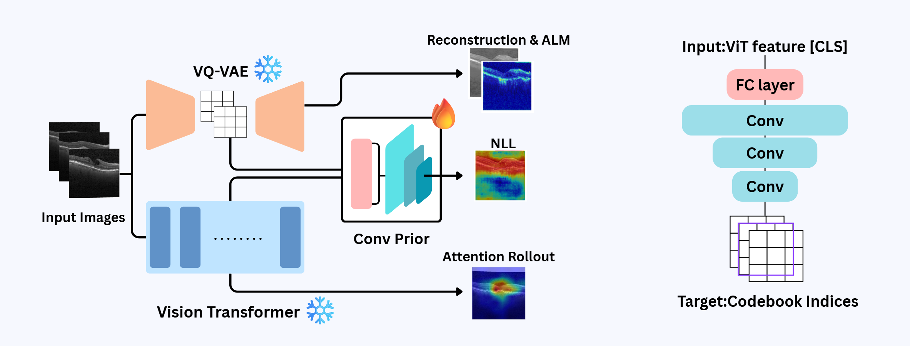
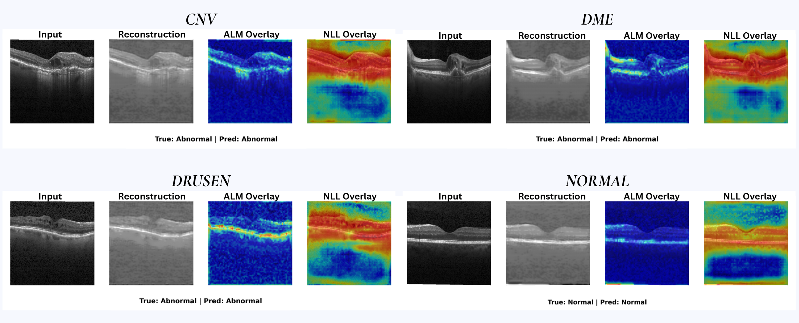

# VQ-ViT Convolutional Fusion: Retinal OCT Anomaly Detection

**[BlendED MIT AI+X Research] - Novo Nordisk Track 3**


---



## 📖 Project Overview

This project aims to detect and localize anomalous regions in retinal Optical Coherence Tomography (OCT) images. This is a challenging task, as the distinction between normal and abnormal scans can be subtle, and pathological features can be diffuse or resemble normal anatomical variations.

To address this, this repository proposes and implements three complementary approaches:

1.  **Discriminative:** A Vision Transformer (ViT) for high-performance classification of normal vs. abnormal scans.
2.  **Generative:** A VQ-VAE trained *only* on normal data to identify anomalies via reconstruction errors.
3.  **Hybrid:** A novel **VQ-ViT Convolutional Fusion** model that combines the global features of ViT with the local reconstruction capabilities of VQ-VAE.

## ✨ Key Features

*   **High-Performance Classification:** Achieves >97% test accuracy in classifying abnormal scans using ViT.
*   **Multi-Scale Anomaly Localization:** Visualizes anomalous regions using three distinct mechanisms:
    *   **Attention Rollout (ViT):** Visualizes *where* the discriminative model "looks" to make its classification.
    *   **ALM (Alignment Loss Map):** Highlights regions where the VQ-VAE fails to reconstruct the image normally.
    *   **NLL (Negative Log-Likelihood) Overlay:** Generates a probability map of "abnormality" predicted by the hybrid model.

## 🏗️ Model Architecture

This project is centered around three core models.

### 1. Approach 1: ViT + Attention Rollout (Discriminative)

*   **Model:** A standard Vision Transformer (ViT).
*   **Training:** A binary classifier trained with supervised learning on both 'Normal' and 'Abnormal' labeled data.
*   **Anomaly Localization:** The attention maps from the trained ViT are aggregated using the `Attention Rollout` technique to visualize the pixel regions most critical for the model's classification decision.

### 2. Approach 2: VQ-VAE + ALM (Generative)

*   **Model:** Vector-Quantized Variational Auto-Encoder (VQ-VAE).
*   **Training:** An unsupervised approach trained **only on 'Normal' images**. The model learns the distribution of healthy retinal anatomy.
*   **Anomaly Detection:** When an abnormal image is input, the model attempts to reconstruct it based on its learned 'normal' distribution. The resulting reconstruction error, specifically the `Alignment Loss Map (ALM)`, highlights areas where the input and reconstruction differ significantly—i.e., the anomalous regions.

### 3. Approach 3: VQ-ViT Convolutional Fusion (Final Hybrid Model)

This model was proposed to overcome the limitations of using VQ-VAE alone (difficulty capturing global semantic anomalies) and the computational cost of autoregressive models.

*   **Core Idea:**
    1.  A pre-trained **ViT (Frozen ❄️)** is used as an encoder to extract global context features from the image.
    2.  A pre-trained **VQ-VAE (Frozen ❄️)** performs pixel-level local reconstruction and generates discrete codebook indices.
    3.  A new **Conv Prior (Trainable 🔥)** module is introduced. This module is trained to predict the VQ-VAE's codebook indices ($z_i^t$) based on the global features ($f_{ViT}$) extracted by the ViT.
*   **Anomaly Localization (NLL):** After training, the NLL (Negative Log-Likelihood) of the Conv Prior's predicted codebook distribution is calculated. Regions where the global features (from ViT) and local features (from VQ-VAE) are misaligned—i.e., anomalous regions—will produce a high NLL value, creating a precise anomaly localization map.

## 📈 Results


## 💾 Dataset
Data: This study used a total of 84,495 retinal OCT images.

Classes:

*   Normal: 26,557
*   DME (Diabetic Macular Edema): 11,590
*   Drusen: 8,858
*   CNV (Choroidal Neovascularization): 37,247

Data Split:

*   Approach 1 (ViT): Split using all Normal/Abnormal data (e.g., Train: 24,985 Normal, 53,222 Abnormal).
*   Approach 2 & 3 (VQ-VAE, Hybrid): Split using only the 26,557 'Normal' images (e.g., Train: 23,901 Normal). Abnormal images are used only during the test phase to evaluate anomaly detection performance.

## 🛠️ Setup

### Prerequisites
- Python 3.8 or higher
- CUDA-compatible GPU (recommended)

### Installation

1.  Clone the repository:
    ```bash
    git clone https://github.com/Blended-Learning-Novo-Nordisk-Team-2/VQVAE-anomaly-detection.git
    cd vqvae
    ```

2.  Install required packages:
    ```bash
    pip install -r requirements.txt
    ```

### Project Structure
```
project_root/
├── kermany2018/              # OCT dataset (should be in parent directory)
│   └── OCT2017/
│       ├── train/
│       │   ├── NORMAL/
│       │   ├── CNV/
│       │   ├── DME/
│       │   └── DRUSEN/
│       └── test/
├── vqvae/                    # Project directory
│   ├── models/               # Model architecture files
│   ├── datasets/             # Dataset handling code
│   ├── saved_models/         # Training outputs
│   │   └── YYYY-MM-DD_HH-MM-SS/
│   │       ├── best-*.ckpt   # Best model checkpoint
│   │       ├── config.yaml   # Training configuration
│   │       └── latent/       # Latent representations
│   ├── test_dataset/         # Test images for inference
│   ├── train.py             # Training script
│   ├── vqvae_inference.py  # Inference script
│   └── utils.py             # Utility functions
```

Note: If your `kermany2018` dataset is located in a different directory, modify the `root` variable in `datasets/dataset.py`:
```python
root = '../path/to/your/kermany2018'
```

## 🚀 Usage

### Training

The training script supports various hyperparameters through command-line arguments. Here's the basic usage:

```bash
python train.py --batch_size 16 --epochs 100 --n_hiddens 256 --embedding_dim 256 --n_embeddings 128 --beta 0.25 --learning_rate 1e-4
```

Required arguments:
- `--batch_size`: Batch size for training
- `--epochs`: Number of training epochs
- `--n_hiddens`: Hidden dimension size
- `--embedding_dim`: Dimension of codebook vectors
- `--n_embeddings`: Size of codebook
- `--beta`: Commitment loss coefficient
- `--learning_rate`: Learning rate for optimization

Optional arguments:
- `--n_residual_hiddens`: Hidden dimension in residual blocks (default: 64)
- `--n_residual_layers`: Number of residual layers (default: 4)
- `--dropout`: Dropout rate (default: 0.1)
- `--patience`: Early stopping patience (default: 10)
- `--min_delta`: Minimum change for early stopping (default: 1e-4)
- `--device`: Training device (default: "gpu")
- `--save`: Whether to save model outputs (default: True)

During training:
1.  A new directory is created in `saved_models/` with the current timestamp
2.  Model checkpoints are saved in this directory
3.  Latent representations are saved in the `latent/` subdirectory
4.  Training configuration is saved as `config.yaml`

### Inference and Visualization

After training, you can run inference and generate visualizations using:

```bash
python vqvae_inference.py --model_dir path/to/saved_models/YYYY-MM-DD_HH-MM-SS/best-*.ckpt
```

Required arguments:
- `--model_dir`: Path to the model checkpoint file

The script will:
1.  Load the trained model
2.  Process images from each category (CNV, DME, DRUSEN, NORMAL)
3.  Generate visualizations including:
    -   Input images
    -   Reconstructed images
    -   Alignment Loss Maps (ALM)
    -   Residual maps
4.  Save visualizations in the `inference/` directory within the model's directory
5.  Compute and display anomaly scores and AUROC metrics

## ⚙️ Hyperparameter Tuning

You can create `sweep.yaml` for hyperparameter optimization with Weights & Biases. The sweep configuration includes:
-   Learning rate
-   Beta (commitment loss)
-   Embedding dimension
-   Number of embeddings
-   Hidden dimensions
-   Dropout

## 🔬 Limitations & Future Work
**Limitation:**

The current convolutional fusion module is relatively shallow. This may limit the model's ability to fully exploit spatial hierarchies and complex contextual dependencies.

**Future Work:**

We plan to explore deeper and more expressive convolutional structures, such as dilated or residual blocks, to further enhance anomaly detection accuracy and localization precision.

We also plan to investigate benchmarking methods for explainability to quantitatively evaluate the model.

## 📚 References
*   VQ-VAE (Oord et al., 2017)
*   Vision Transformer (Dosovkiy et al., 2021)
*   GMAR (Jo et al., 2025)
*   VQ-VAE Anomaly Detection (Jebril et al., 2024)
